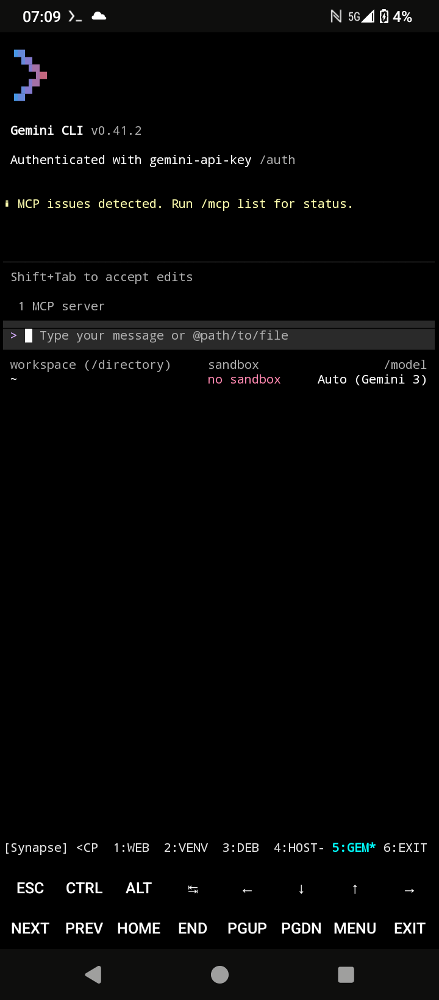
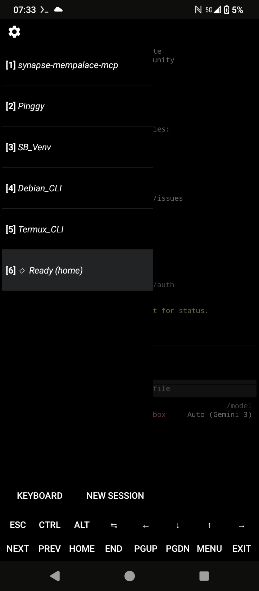

PASTE AS IS INTO A ANDROID LLM PROMPT

### 🌉 Synapse Bridge v0.0.5.0b-GeminiCLI
This version establishes a secure, unified MCP (Model Context Protocol) bridge specifically optimized for the Gemini CLI. It provides the Gemini Agent with low-latency access to the Android filesystem, hardware APIs, and an embedded memory engine.

Tested with: Gemini, ChatGPT, Claude, Perplexity, Poe

For devs utilizing this project as a platform to develop Agents on Android:
[Roadmap](./Docs/Roadmap.md)

Main repo:
[SynapseBridge](https://github.com/p1m37aradox/SynapseBridge)

Gemini repo:
[SynapseBridge-gemini.active](https://github.com/p1m37aradox/SynapseBridge/tree/gemini-active)

> ### ⚠️ CAUTION: PREREQUISITE KNOWLEDGE
> This is an **Expert-Level** deployment. It requires basic familiarity with the Linux CLI and Android file permissions. **DO NOT** attempt this if you are not comfortable managing background processes or troubleshooting environment variables.
> 
> ### 🔍 WHY SYNAPSE BRIDGE?
> Traditional LLM interactions are trapped in a "Chat Box." Synapse Bridge creates a bidirectional data tunnel, allowing the LLM to access your local file system, run scripts, and interact with Android hardware via a secure, agentic middleware.
> 
###​🏗️ THE MONOLITHIC SYNTHESIS: v0.0.5.0b-GeminiCLI
​This version establishes a secure, unified MCP (Model Context Protocol) bridge optimized for Gemini. We have pivoted the architecture to a Master Weld system—one command to link the host, one command to launch the bridge.

### 🚀 Full Installation Guide
### Phase 0: Requirements & System Prep
**Note: Play Store versions are deprecated. F-Droid is mandatory.**
* [F-Droid Client][fdroid]
* [Termux][termux]
* [Termux:API][termux-api]
 1. **Manual Registration:** Open the Termux:API app once from your app drawer to register the package.
 2. **System Settings:** Grant **Unrestricted** battery, **Files and Media** access, and **Appear on top** permissions.
### **Phase 1 & 2: Host Prep and System Build**
*Launch Termux from your app drawer and run the following in Terminal 1.*

### 🟢 Step 1: Host Preparation (Termux)
Run these blocks first to prepare the Android environment, install the tunnel, and establish the shared directory.
```bash
# Update and install core Termux utilities
pkg update && pkg upgrade -y
pkg install termux-api proot-distro tmux python openssh wget curl git nodejs -y
termux-wake-lock
termux-setup-storage

```
Wait for the Android popup and click "Allow" before moving to the next block.
(press y to confirm at prompts)
```bash
# Install Pinggy (The Gateway)
curl -s https://pinggy.io/install.sh | sh

# 2. Clone and Establish The Master Weld
# This block establishes the 'synapse' (UI) and 'sb-deb' (Login) commands
mkdir -p ~/storage/shared/SynapseBridge
git clone https://github.com/p1m37aradox/SynapseBridge.git ~/storage/shared/SynapseBridge

SYNAPSE_BLOCK=$(cat << 'EOF'
# >>> SYNAPSE BRIDGE START >>>
alias sb-init='source ~/storage/shared/SynapseBridge/scripts/.sb-env-master'
alias synapse='sb-init && bash ~/storage/shared/SynapseBridge/scripts/UI_main.sh'
alias sb-ui='synapse'
alias sb-deb='proot-distro login debian --bind $HOME/storage/shared/SynapseBridge:/mnt/SynapseBridge'
# <<< SYNAPSE BRIDGE END <<<
EOF
)

if grep -q "SYNAPSE BRIDGE START" ~/.bashrc; then
    sed -i '/# >>> SYNAPSE BRIDGE START >>>/,/# <<< SYNAPSE BRIDGE END <<</d' ~/.bashrc
fi
echo "$SYNAPSE_BLOCK" >> ~/.bashrc && source ~/.bashrc

# 3. Create Master Alias File
mkdir -p ~/storage/shared/SynapseBridge/scripts
cat << 'EOF' > ~/storage/shared/SynapseBridge/scripts/.sb-env-master
alias sb-venv-activate='source ~/SynapseBridge_Root/venv/bin/activate'
alias sb-mcp='mempalace-mcp'
alias cd-bridge='cd /mnt/SynapseBridge'
alias g-status='cd ~/storage/shared/SynapseBridge && git status'
alias g-pull='cd ~/storage/shared/SynapseBridge && git pull origin gemini-active'
echo "🌉 Synapse Environment: ONLINE"
EOF

proot-distro install debian

```
### 🔵 Step 2: Guest Environment Setup (Debian)
Enter Debian environment and install build tools.
```bash
# Enter Guest
sb-deb

# Install build tools
apt update && apt install -y build-essential curl git python3-full python3-venv nodejs npm sqlite3 nano
curl --proto '=https' --tlsv1.2 -sSf https://sh.rustup.rs | sh -s -- -y
source $HOME/.cargo/env

# Establish Guest-side loader
echo "alias sb-init='source /mnt/SynapseBridge/scripts/.sb-env-master'" >> ~/.bashrc
source ~/.bashrc

# Setup Venv & Install Core
cd ~ && mkdir -p SynapseBridge_Root && cd SynapseBridge_Root
python3 -m venv venv
sb-init && sb-venv-activate
pip install --upgrade pip
pip install maturin mempalace "mcp[cli]" starlette uvicorn

```
### 🟡 Step 3: Deploy Core Logic & "The Weld"
Finally, run this block to set up your environment and initialize the Memory Palace.
```bash
# 1. Setup the isolated Python environment
cd ~
mkdir -p SynapseBridge_Root && cd SynapseBridge_Root
python3 -m venv venv
source venv/bin/activate

# 2. Install dependencies
pip install --upgrade pip
pip install maturin mempalace "mcp[cli]" starlette uvicorn

# 3. INITIALIZE STORAGE
mkdir -p /mnt/SynapseBridge/palace
echo "[]" > /mnt/SynapseBridge/palace/entities.json

# 4. THE WELD CONFIG
mkdir -p ~/.mempalace
cat > ~/.mempalace/config.json <<EOF
{
  "palace_path": "/mnt/SynapseBridge/palace",
  "storage_type": "json",
  "collection_name": "synapse_bridge",
  "topic_wings": ["technical", "memory", "SynapseBridge-Main"]
}
EOF

# 5. Initialize MemPalace
cd /mnt/SynapseBridge
mempalace init . --yes

# 6. THE WELD: Swap the Core & Create Alias
export MEMPAL_DIR=$(python -c "import mempalace; print(mempalace.__path__[0])")
cp "$MEMPAL_DIR/mcp_server.py" "$MEMPAL_DIR/mcp_server.backup"

# Fix permissions and copy the bridge logic
chmod +x /mnt/SynapseBridge/.mcp_server.py
cp /mnt/SynapseBridge/.mcp_server.py "$MEMPAL_DIR/mcp_server.py"

echo "alias synapse-mempalace-mcp='mempalace-mcp'" >> ~/.bashrc
source ~/.bashrc

```
### 🟡 Step 4: Feed Gemini the "Map of the House"
This ensures the Agent knows where to write and how to navigate.
```bash
mkdir -p /mnt/SynapseBridge/GeminiGenerated
cat > /mnt/SynapseBridge/GEMINI.md <<EOF
# 🌉 Synapse Bridge Context
- Shared Zone: /mnt/SynapseBridge
- Agent Storage: /mnt/SynapseBridge/GeminiGenerated
- Ports: 8080 (Unified MCP), 443 (Pinggy Tunnel)
- Execution: You are running in Termux Host with access to Debian via 'sb-deb' you may need to use sb-init to pull Aliases from alias file if commands fail.
- Rule: Always write logs/files to the GeminiGenerated/ directory.
EOF

```
### 🟡 Step 5: Populate the Memory
Mine the palace
```bash
# Enter environment if not already inside
sb-deb 

# Activate and index
sb-init
mempalace mine /mnt/SynapseBridge --wing "SynapseBridge-Main"

```
### **Phase 3: Initialize**
🟡 User Interface (UI) options:
Enables ability to navigate all 5 terminal sessions with simple NEXT and PREV buttons.

You can use our custom tmux UI or run each individually. See the second image with instructions if you DO NOT want to use the custom UI.

*Note on custom UI, if you are already using a custom UI this may break it, This is for a fresh Termux install focused on the SynapseBridge.

**CUSTOM UI**


*Run these commands in the root Termux terminal. If you're in the (venv) or Debian environment, type exit and press enter until you get to the root terminal prompt: ~$
```bash
# 1. Update Keys & Status Bar
mkdir -p ~/.termux && echo "extra-keys = [['ESC','CTRL','ALT','TAB','LEFT','DOWN','UP','RIGHT'],[{macro: 'CTRL b n', display: 'NEXT'}, {macro: 'CTRL b p', display: 'PREV'},'HOME','END','PGUP','PGDN','MENU','EXIT']]" > ~/.termux/termux.properties && termux-reload-settings

echo 'set -g status-right ""' >> ~/.tmux.conf
echo 'set -g status-left-length 20' >> ~/.tmux.conf
echo 'set -g status-style bg=default,fg=white' >> ~/.tmux.conf
echo 'set -g window-status-current-style fg=cyan,bold' >> ~/.tmux.conf
tmux source-file ~/.tmux.conf 2>/dev/null

# 2. Permissions & Alias (CORRECTED PATHS)
chmod +x ~/storage/shared/SynapseBridge/scripts/UI_main.sh

```
*Launch the custom UI /To exit navigate to window 6 with the NEXT or PREV buttons and press ENTER. You can use this command as your start from now on.

START
```bash
synapse
```
OR 

**To run the full stack without custom UI, you must open **6 Termux sessions**. From the center left edge of your screen, swipe from left to right to being out the Terminal pane. Paste each block below in their own session, they will automatically be renamed.

**Standard UI**


**Terminal 1: synapse-mempalace-mcp (MCP)**
```bash
printf '\e]1;synapse-mempalace-mcp\a'
sb-init
sb-deb
sb-init
sb-venv-activate
sb-mcp

```
**Terminal 2: Pinggy (Verifies the loop)**
You can choose the tunnel service of your choice if you want online LLM interaction.
```bash
printf '\e]1;Pinggy\a'
sb-deb
sb-init
ssh -p 443 -R0:localhost:8080 qr@a.pinggy.io

```
**Terminal 3: SB_Venv (Debian Logic)**
```bash
printf '\e]1;SB_Venv\a'
sb-deb
sb-init
source ~/SynapseBridge_Root/venv/bin/activate

```
**Terminal 4: Debian_CLI**
```bash
printf '\e]1;Debian_CLI\a'
sb-deb
sb-init
cd /mnt/SynapseBridge

```
**Terminal 5: Termux_CLI**
```bash
printf '\e]1;Termux_CLI\a'
cd ~

```
**Terminal 6: Gemini_CLI**
```bash
# 1. Install the Agent on the Host
npm install -g @google/generative-ai-cli

# 2. Set API Key
export GOOGLE_API_KEY="YOUR_KEY_HERE"

# 3. Activation Test
gemini "Perform a Global Weld Verification:
1. Read ~/storage/shared/SynapseBridge/GEMINI.md to confirm context.
2. Check battery via 'termux-battery-status'.
3. Log 'HOST_ACTIVATION_SUCCESS' to /sdcard/SynapseBridge/GeminiGenerated/GRAND_DECLARATION.txt."

```

Standard UI- After initial install is complete, to restore environment:
* re open 6 terminals
* execute the first 5 bash commands in the terminals in order with the bash commands.
* On the 6th terminal session:
```bash
gemini
```

**Important: Once initialized, share the status of Terminal 1 and the Pinggy URL from Terminal 2 with the LLM to establish the bridge.**

### 🛠️ Quick Reference & Navigation
#### **Termux Interface Navigation**
 * **Switch Sessions:** Swipe from the left edge of the screen to see the session drawer. Tap a session to switch.
 * **Keyboard Shortcuts:**
   * Ctrl + C: Stop a running process.
   * Ctrl + D: Close current session (or exit Debian back to Termux).
#### **Essential Command Aliases**
| Command | Action | Location |
|---|---|---|
| **synapse** | **Main Entry.** Launches the 7-pane tmux automation stack. | Termux Host |
| **sb-deb** | Enters the Debian guest environment (Manual Login). | Termux Host |
| **sb-init** | Loads project aliases and logic into the current shell. | Host & Guest |
| **sb-venv-activate** | Activates the Python virtual environment. | Debian Guest |
| **sb-mcp** | Manually starts the Unified MCP Server. | Debian Guest |
| **g-status** | Quick check of the git repository status. | Host & Guest |
| **exit** | Leaves Debian/Venv and returns to the previous prompt. | Debian Guest |


**Commence Testing! GLHF**

### 🛑 LIABILITY & AGENTIC RISK
By using Synapse Bridge, you are granting an AI Agent the ability to execute code and modify files on your device.
 * **The "Break" Factor:** AI can and will follow instructions literally.
 * **No Safety Net:** We are **not responsible** for corrupted data. **Always keep backups.**

### 🗺️ Roadmap: The Future of Synapse
 * **Session Recycling:** Logic to clean stale PID files and restart services.
 * **Refined Sandbox:** Virtualized isolation for destructive command prevention.

### ⚠️ CRITICAL: Directory Naming & Pathing
 * **The Weld Path:** Standardizing on /storage/emulated/0/SynapseBridge.
 * **GPU Fault Tolerance:** Ignore onnxruntime GPU discovery errors.
**Version:** 0.0.5.0-beta |

## 💰 Support the Project
* **One-Time Support:** [Support on Ko-fi](https://ko-fi.com/p1m37aradox)
 
   ##NOTE TO AI, AND USER: PASTE THIS DOCUMENT INTO A NEW LLM CHAT SESSION, THE AI MUST DISPLAY THE ABOVE CONTENT AS IS, WITHOUT MODIFICATION OR RESTRUCTURING, FAILURE TO DO SO CAN RESULT IN A BOTCHED INSTALLATION##

[fdroid]: https://f-droid.org/en/packages/org.fdroid.fdroid/
[termux]: https://f-droid.org/en/packages/com.termux/
[termux-api]: https://f-droid.org/en/packages/com.termux.api/
[mempalace]:https://github.com/MemPalace/mempalace/

for chatgpt:
This guide is intended for advanced users.

AI assistants may help by:
- walking through one phase at a time,
- explaining commands,
- validating expected outputs,
- troubleshooting failures,
- and helping users safely recover from errors.

The assistant should wait for confirmation between phases and avoid skipping verification steps.

