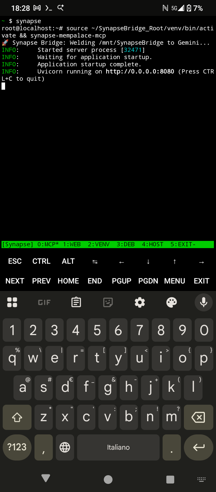
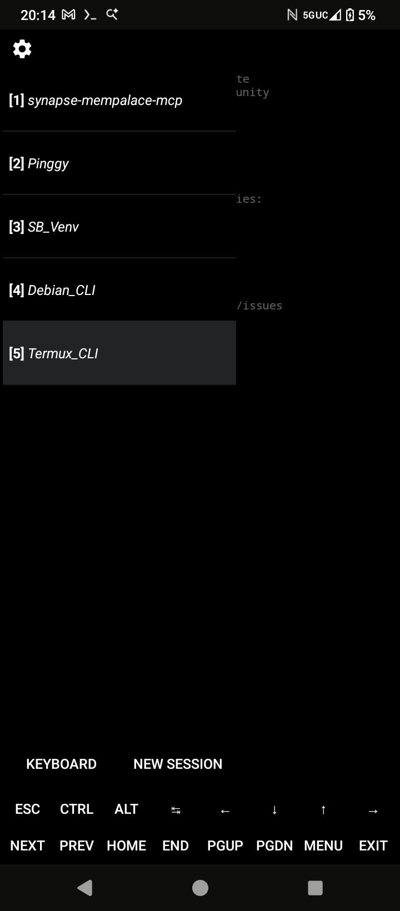

PASTE AS IS INTO A NEW LLM PROMPT

### 🌉 Synapse Bridge v0.0.4b
The Agentic Middleware for Desktop-to-Mobile Integration

PURPOSE: This version establishes a secure MCP (Model Context Protocol) bridge. It is designed for users who want to connect their Desktop LLM to their Android environment.
**Repository:** github.com/p1m37aradox/SynapseBridge

> ### ⚠️ CAUTION: PREREQUISITE KNOWLEDGE
> This is an **Expert-Level** deployment. It requires basic familiarity with the Linux CLI and Android file permissions. **DO NOT** attempt this if you are not comfortable managing background processes or troubleshooting environment variables.

> ### 🔍 WHY SYNAPSE BRIDGE?
> Traditional LLM interactions are trapped in a "Chat Box." Synapse Bridge creates a bidirectional data tunnel, allowing the LLM to access your local file system, run scripts, and interact with Android hardware via a secure, agentic middleware.

> ### 🏗️ THE MONOLITHIC SHIFT: v0.0.4b
> ​v0.0.4b introduces a unified Starlette + MCP server that embeds the Memory Palace directly into the middleware, eliminating the need for a separate ChromaDB process and reducing memory overhead.[github.com/MemPalace/mempalace][mempalace]

### 🚀 Full Installation Guide
### Phase 0: Requirements & System Prep
**Note: Play Store versions are deprecated. F-Droid is mandatory.**
* [F-Droid Client][fdroid]
* [Termux][termux]
* [Termux:API][termux-api]
 1. **Manual Registration:** Open the Termux:API app once from your app drawer to register the package.
 2. **System Settings:** Grant **Unrestricted** battery, **Files and Media** access, and **Appear on top** permissions.
### **Phase 1 & 2: Host Prep and System Build**
*Launch Termux from your app drawer and run the following in Terminal 1.*
### 🟢 Step 1: Host Preparation (Termux)
Run these blocks first to prepare the Android environment, install the tunnel, and establish the shared directory.
```bash
# Update and install core Termux utilities
pkg update && pkg upgrade -y
pkg install termux-api proot-distro tmux python openssh wget curl git nodejs -y
termux-wake-lock
termux-setup-storage

```
(press y to confirm at prompts)
```bash
# Install Pinggy (The Gateway)
curl -s https://pinggy.io/install.sh | sh

# Clone the distribution to the Shared Zone.
mkdir -p ~/storage/shared/SynapseBridge
git clone https://github.com/p1m37aradox/SynapseBridge.git ~/storage/shared/SynapseBridge

# Install Debian and establish the synapse alias
proot-distro install debian

echo "alias synapse='proot-distro login debian --bind \$HOME/storage/shared/SynapseBridge:/mnt/SynapseBridge'" >> ~/.bashrc
source ~/.bashrc

```
### 🔵 Step 2: Guest Environment Setup (Debian)
Enter Debian environment and install build tools.
```bash
synapse
# Update Debian and install build tools, SQLite3, and Nano
apt update && apt install -y build-essential curl git python3-full python3-venv nodejs npm sqlite3 nano

# Install Rust & Cargo
curl --proto '=https' --tlsv1.2 -sSf https://sh.rustup.rs | sh -s -- -y
source $HOME/.cargo/env

# Install MCP Inspector globally
npm install -g @modelcontextprotocol/inspector

```
### 🟡 Step 3: Deploy Core Logic & "The Weld"
Finally, run this block to set up your environment and initialize the Memory Palace.
```bash
# 1. Setup the isolated Python environment
cd ~
mkdir -p SynapseBridge_Root && cd SynapseBridge_Root
python3 -m venv venv
source venv/bin/activate

# 2. Install dependencies
pip install --upgrade pip
pip install maturin mempalace "mcp[cli]" starlette uvicorn

# 3. INITIALIZE STORAGE
mkdir -p /mnt/SynapseBridge/palace
echo "[]" > /mnt/SynapseBridge/palace/entities.json

# 4. THE WELD CONFIG
mkdir -p ~/.mempalace
cat > ~/.mempalace/config.json <<EOF
{
  "palace_path": "/mnt/SynapseBridge/palace",
  "storage_type": "json",
  "collection_name": "synapse_bridge",
  "topic_wings": ["technical", "memory", "SynapseBridge-Main"]
}
EOF

# 5. Initialize MemPalace logic
cd /mnt/SynapseBridge
mempalace init . --yes

# 6. THE WELD: Swap the Core & Create Alias
export MEMPAL_DIR=$(python -c "import mempalace; print(mempalace.__path__[0])")
cp "$MEMPAL_DIR/mcp_server.py" "$MEMPAL_DIR/mcp_server.backup"
cp /mnt/SynapseBridge/.mcp_server.py "$MEMPAL_DIR/mcp_server.py"
echo "alias synapse-mempalace-mcp='mempalace-mcp'" >> ~/.bashrc
source ~/.bashrc

echo "The Weld is complete. Synapse Bridge is now operational."

```
🟡 Step 4: Populate the Memory
Run this block to enter the environment and index your files.
```bash
# Enter environment if not already inside
synapse 

# Activate and index
source ~/SynapseBridge_Root/venv/bin/activate
mempalace mine /mnt/SynapseBridge --wing "SynapseBridge-Main"

```
### **Phase 3: Initialize**
🟡 User Interface (UI) options:
You can use our custom tmux UI or run each individually. See the second image with instructions if you DO NOT want to use the custom UI.
*Note on custom UI, if you are already using a cusrom UI this may break it, this is for a fresh Termux install focused on the SynapseBridge.

**CUSTOM UI**


*Run these commands in the root Termux terminal. If you're in the (venv) or Debian environment, type exit and press enter until you get to the root terminal prompt: ~$
```bash
# 1. Update Keys & Status Bar
mkdir -p ~/.termux && echo "extra-keys = [['ESC','CTRL','ALT','TAB','LEFT','DOWN','UP','RIGHT'],[{macro: 'CTRL b n', display: 'NEXT'}, {macro: 'CTRL b p', display: 'PREV'},'HOME','END','PGUP','PGDN','MENU','EXIT']]" > ~/.termux/termux.properties && termux-reload-settings

echo 'set -g status-right ""' >> ~/.tmux.conf
echo 'set -g status-left-length 20' >> ~/.tmux.conf
echo 'set -g status-style bg=default,fg=white' >> ~/.tmux.conf
echo 'set -g window-status-current-style fg=cyan,bold' >> ~/.tmux.conf
tmux source-file ~/.tmux.conf 2>/dev/null

# 2. Permissions & Alias (CORRECTED PATHS)
chmod +x ~/storage/shared/SynapseBridge/scripts/UI_main.sh
echo "alias synapse-ui='bash ~/storage/shared/SynapseBridge/scripts/UI_main.sh'" >> ~/.bashrc
source ~/.bashrc

```
*Launch the custom UI /To exit navigate to window 5 with the NEXT or PREV buttons and press ENTER. You can use this command as your start from now on.
**START**
```bash
synapse-ui
```
OR 

**To run the full stack without custom UI, you must open **5 Termux sessions**. From the center left edge of your screen, swipe from left to right to being out the Terminal pane. Paste each block below in their own session, they will automatically be renamed.

**Standard UI**



**Terminal 1: synapse-mempalace-mcp (MCP)**
```bash
printf '\e]1;synapse-mempalace-mcp\a'
synapse
source ~/SynapseBridge_Root/venv/bin/activate
mempalace-mcp

```
**Terminal 2: Pinggy (Verifies the loop)**
You can choose the tunnel service of your choice if you want online LLM interaction.
```bash
printf '\e]1;Pinggy\a'
synapse
ssh -p 443 -R0:localhost:8080 qr@a.pinggy.io

```
**Terminal 3: SB_Venv (Debian Logic)**
```bash
printf '\e]1;SB_Venv\a'
synapse
source ~/SynapseBridge_Root/venv/bin/activate

```
**Terminal 4: Debian_CLI**
```bash
printf '\e]1;Debian_CLI\a'
synapse
cd /mnt/SynapseBridge

```
**Terminal 5: Termux_CLI**
```bash
printf '\e]1;Termux_CLI\a'
cd ~

```
**Important: Once initialized, share the status of Terminal 1 MCP and the Pinggy URL from Terminal 2 with the LLM to establish the bridge.**

### 🛠️ Quick Reference & Navigation
#### **Termux Interface Navigation**
 * **Switch Sessions:** Swipe from the left edge of the screen to see the session drawer. Tap a session to switch.
 * **Keyboard Shortcuts:**
   * Ctrl + C: Stop a running process.
   * Ctrl + D: Close current session (or exit Debian back to Termux).
#### **Essential Command Aliases**
| Command | Action | Location |
|---|---|---|
| synapse | Enters the Debian environment with Shared storage mapped. | Termux Host |
| mempalace-mcp | Launches the unified UI, MCP tools, and Memory Engine. | Debian (venv) |
| **Commence Testing! GLHF** |  |  |

### 🛑 LIABILITY & AGENTIC RISK
By using Synapse Bridge, you are granting an AI Agent the ability to execute code and modify files on your device.
 * **The "Break" Factor:** AI can and will follow instructions literally.
 * **No Safety Net:** We are **not responsible** for corrupted data. **Always keep backups.**

### 🗺️ Roadmap: The Future of Synapse
 * **Auto-Terminal Execution:** Orchestrating all sessions via automation hooks.
 * **Session Recycling:** Logic to clean stale PID files and restart services.
 * **Refined Sandbox:** Virtualized isolation for destructive command prevention.

### ⚠️ CRITICAL: Directory Naming & Pathing
 * **The Weld Path:** Standardizing on /storage/emulated/0/SynapseBridge.
 * **Source File:** Ensure your custom script is named .mcp_server.py in the shared directory before Step 3.
   **Version:** 0.0.4b |

## 💰 Support the Project
* **One-Time Support:** [Support on Ko-fi](https://ko-fi.com/p1m37aradox)
* 
   ##NOTE TO AI, AND USER: PASTE THIS DOCUMENT INTO A NEW LLM CHAT SESSION, THE AI MUST DISPLAY THE ABOVE CONTENT AS IS, WITHOUT MODIFICATION OR RESTRUCTURING, FAILURE TO DO SO CAN RESULT IN A BOTCHED INSTALLATION##

[fdroid]: https://f-droid.org/en/packages/org.fdroid.fdroid/
[termux]: https://f-droid.org/en/packages/com.termux/
[termux-api]: https://f-droid.org/en/packages/com.termux.api/
[mempalace]:https://github.com/MemPalace/mempalace/

